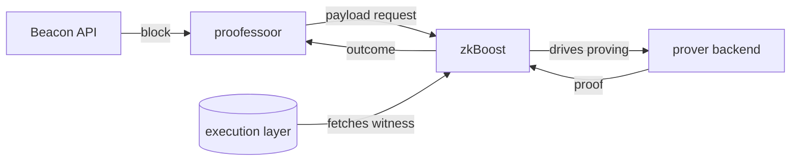

<p align="center">
  
</p>

# proofessoor

A small, clientless requestor that asks [zkBoost](https://github.com/eth-act/zkboost)
to prove Ethereum execution blocks — and tracks how each request goes.

> **Clientless** means it runs no execution or consensus client of its own. It
> only speaks HTTP to a Beacon API (to read blocks) and to zkBoost (to request
> proofs). That keeps it small and easy to run next to existing infrastructure.

## What it does

proofessoor watches Ethereum blocks and drives a proof request for each one, then
records how every request turns out. For each new block it reads the block from a
Beacon API, builds the payload request zkBoost expects, submits it, and tracks the
outcome. zkBoost coordinates the proving — it fetches the execution witness and
runs whatever prover backend it's configured with.



proofessoor is deliberately narrow in scope: it requests proofs and tracks their
status. It does not sign, run a validator, or execute blocks itself — which is
what keeps it small. It also doesn't care *how* zkBoost proves a block: the prover
backend might be a single ZisK server, a cluster, or anything else zkBoost
supports. proofessoor only speaks to zkBoost's API.

## Build

```bash
cargo build --release        # binary at target/release/proofessoor
```

The dashboard (optional, served by `stream`) is a separate frontend build:

```bash
cd frontend && bun install && bun run build   # assets land in frontend/dist
```

Prefer containers? See [Run the full stack](#run-the-full-stack).

## Configure

Two endpoints are always required — pass them as flags or environment variables:

- **`--beacon-rpc`** (`PROOFESSOOR_BEACON_RPC`) — your Beacon API's HTTP
  endpoint. Supplies the blocks to prove.
- **`--zkboost-url`** (`PROOFESSOOR_ZKBOOST_URL`) — your zkBoost instance's
  address. Coordinates the proving.

zkBoost itself needs an execution-layer RPC that serves
`debug_executionWitnessByBlockHash` — that's configured in zkBoost, not here.

## Core commands

The examples use `reth-zisk` as a proof type; use whatever your zkBoost is
configured for (`check` lists them).

### `check` — is zkBoost reachable, and can it prove what I want?

```bash
proofessoor check --zkboost-url <zkboost-url> --proof-types reth-zisk
```

Lists the proof types zkBoost can currently produce, and fails if any requested
type is unavailable. Run this first.

### `request` — prove one block, then exit

```bash
proofessoor request \
  --beacon-rpc <beacon-api> \
  --zkboost-url <zkboost-url> \
  --proof-types reth-zisk \
  --block-id head \
  --wait --verify
```

`--block-id` accepts `head`, `genesis`, `finalized`, `justified`, a slot number,
or a `0x` block root. Add `--wait` to block until the proof finishes, `--verify`
to verify it through zkBoost, and `--download`/`--out-dir` to save the proof
bytes. One-shot `request` can take several proof types at once.

### `stream` — keep proving new blocks

```bash
proofessoor stream \
  --beacon-rpc <beacon-api> \
  --zkboost-url <zkboost-url> \
  --proof-types reth-zisk \
  --state-dir ./state \
  --http-addr <host:port> \
  --ui-dir frontend/dist
```

Follows the Beacon API event stream and requests a proof for each new
non-optimistic block. Useful flags:

- `--max-inflight N` — cap concurrent submissions (default 1).
- `--state-dir DIR` — persist status so restarts don't re-request blocks.
- `--http-addr HOST:PORT` — serve the dashboard, metrics, and health (below).
- `--ui-dir DIR` — directory of built dashboard assets to serve.
- `--download` / `--verify` / `--out-dir` — save and/or verify completed proofs.

> **Stream proves one proof type at a time.** It records one outcome per block,
> which can't represent different results for several proof types on the same
> block, so it accepts exactly one `--proof-types` value. Use `request` for
> multiple.

`--http-addr` takes a host and port of your choosing and serves three things on
that address: the dashboard at `/`, Prometheus metrics at `/metrics`, and a
health check at `/health`.

### `status` — read what was recorded

```bash
proofessoor status --state-dir ./state
```

Prints each recorded request with its outcome and per-block timing (prep,
zkBoost, end-to-end) — the same data the dashboard shows, from the terminal.

## Run the full stack

To run real proving on a GPU box (proofessoor + zkBoost + a prover), see
[`deploy/gpu/`](deploy/gpu/) — a Docker Compose stack, with its own README, that
wires up an ere-server (ZisK) as the backend.

## Development

```bash
cargo fmt --check
cargo clippy --all-targets --locked -- -D warnings
cargo test --locked
cargo deny check                              # dependency advisories + licenses

cd frontend && bun run check && bun run test && bun run build
```

The toolchain is pinned in `rust-toolchain.toml`; lint policy lives in
`Cargo.toml` (`[lints.clippy]`) and `clippy.toml`; dependency policy in
`deny.toml`.

## License

MIT OR Apache-2.0.
